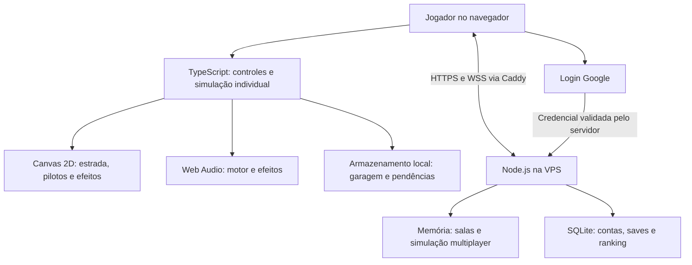

# Ficha técnica para conferir o vídeo — Asfalto Bruto

Base inicial: código publicado `ddfdb19` e registro documental `558e437`. Seções de conta, economia e multiplayer atualizadas para o beta 1.1.0 (protocolo 14); regras de física do ranking permanecem em 3. A base anterior de contas é preservada. As referências abaixo são caminhos relativos à raiz do projeto, exceto as explicitamente identificadas como catálogo.

## A arquitetura em uma imagem

O fluxo Google é simplificado no desenho: o navegador recebe a credencial e a envia ao serviço do jogo; o servidor valida a assinatura e os demais campos. A própria conta Google não armazena a garagem.

## Tecnologias e responsabilidades

| Parte | Implementação atual | Referências |
| --- | --- | --- |
| Linguagem e build | TypeScript, Vite; esbuild para empacotar serviços/API | `package.json`, `vite.config.ts`, `scripts/export-jogos.mjs` |
| Desenho | Canvas 2D, estrada projetada em perspectiva, sprites por código e caches | `src/game/renderer.ts`, `sprites.ts`, `scenery.ts` |
| Piloto caído | Pequena malha com volume, faces sombreadas e projeção no Canvas | `src/game/fallen-rider-art.ts` |
| Simulação | Passos de 1/60 s, comandos, RNG com seed, estado serializável | `src/game/simulation.ts`, `types.ts` |
| Sons | Web Audio, osciladores, filtros, ruído e envelopes de volume | `src/game/audio.ts` |
| Interface | HTML/CSS, controles de teclado e analógicos por toque | `src/main.ts`, `src/touch.css`, `src/game/controls.ts` |
| Rede | WebSocket, mensagens JSON, autoridade do servidor, previsão limitada no cliente | `src/multiplayer/`, `server/service.ts`, `server/room.ts` |
| Conta e banco | Google Identity Services, validação com jose, SQLite via node:sqlite | `src/account/`, `server/accounts.ts`, `accounts-db.ts`, `google.ts` |
| Hospedagem | VPS, Caddy, Node.js e systemd | Catálogo: `infra/vps/` |
| Testes | Node/tsx e Playwright; testes determinísticos, navegador e atraso de rede | `tests/`, `output/falls-integration/` |

O Asfalto não depende de IA generativa durante uma partida. A IA usada no desenvolvimento e a IA dos rivais são coisas distintas: os rivais executam regras do código.

## Física e parâmetros que podem ser citados

| Item | Valor ou regra conferida |
| --- | --- |
| Passo de simulação | 1/60 s; não implica FPS garantido |
| Coordenadas | x lateral e z ao longo da estrada, em metros; velocidade interna em m/s |
| Curva | Carga cresce com velocidade² e curvatura; diminui com agilidade efetiva |
| Velocidade de referência da curva | `sqrt(3000 * agilidade / abs(curvatura))`; é um parâmetro arcade |
| Asfalto na chuva | Multiplicador de aderência 0,82; frenagem 0,88 |
| Terra | Acrescenta multiplicadores de aderência 0,92 e frenagem 0,94, mais arrasto; inclinação influencia a aceleração |
| Elevações | Participam do desenho nas pistas; força de subida/descida na aceleração está implementada especificamente na Terra Brava |
| Joelheira | Até 4 s, ativação acima de 20 m/s (72 km/h); bônus depende de curva, velocidade, lado e contato; chopper incompatível |
| Queda de joelho na chuva | Mais de 2 s contínuos de contato, não dois segundos de qualquer animação de inclinação |
| Dourada | +55% máximo na agilidade efetiva do apoio; cerca de +25% na velocidade de referência da curva |
| Nitro | 2.500 créditos/carga; 5 s; ×1,1 na aceleração e velocidade máxima |
| Empinada manual | 3 usos/corrida, até 2,4 s; salto seleciona alvo e não dá invulnerabilidade geral |
| Salto | Arco de altura controlado por função seno, duração de 1 s; não é integração de um corpo rígido balístico completo |
| Recuperação a pé | Estados sliding/gettingUp/walking/mounting/exploding; corpo e moto com movimento separado |
| Montagem | Proximidade de até 1,35 m da moto parada; animação de 0,65 s |
| Explosão | Pegar moto com integridade zero inicia efeito de 1,8 s e derrota |
| Polícia | Máxima calculada acima da melhor moto com melhorias e nitro: aproximadamente 353 km/h; não mantém essa velocidade em todas as curvas |
| Prisão na queda | Policial ativo a até 30 m; também existe captura por permanecer lento próximo ao policial |

Referências: `src/game/content.ts`, `simulation.ts`, `conditions.ts`, `road-profile.ts`, `equipment.ts`, `stunts.ts`, `recovery.ts`.

## Motos: custo e diferenças

Velocidades abaixo são valores de catálogo sem melhorias; danos, terreno e pilotagem alteram o desempenho efetivo.

| Moto | Estilo | Preço em créditos | Máxima de catálogo | Agilidade | Resistência | Nitro máximo |
| --- | --- | ---: | ---: | ---: | ---: | ---: |
| Ferro 500 | Street | Inicial | 230,4 km/h | 1,10 | 1,00 | 2 |
| Falcão 450 | Supermoto | 10.000 | 216,0 km/h | 1,60 | 0,82 | 2 |
| Estradeira 900 | Cruiser | 18.000 | 237,6 km/h | 1,00 | 1,55 | 2 |
| Veneno 750 | Esportiva | 30.000 | 262,8 km/h | 1,20 | 0,95 | 3 |
| Lobo 1200 | Chopper | 45.000 | 255,6 km/h | 0,82 | 1,70 | 3 |
| Agulha 600 | Café racer | 65.000 | 248,4 km/h | 1,42 | 0,90 | 3 |
| Brutal 1000 | Muscle | 100.000 | 280,8 km/h | 0,95 | 1,40 | 5 |

Referência: `src/game/bikes.ts`. “Melhor moto” depende do critério: a mais cara e mais veloz não é a mais ágil nem a mais resistente.

## Estradas e condições

| Estrada | Extensão | Características existentes |
| --- | ---: | --- |
| Costa do Sol | 8,4 km | Litoral, guard rail à esquerda, sereia rara no mar |
| Serra da Fumaça | 9,2 km | Montanha, guard rails dos dois lados, três árvores cobrindo três faixas |
| Vale Vermelho | 10,2 km | Deserto, cinco eventos de feno e duas travessias de tatu |
| Porto Ferrugem | 7,8 km | Curvas específicas, caminhões, obras, duas filas de cinco carros, passageiro decorativo raro |
| Terra Brava | 7,2 km | Duas faixas, curvas específicas, relevo, barrancos, tratores, lama/cascalho, quatro rampas, Saci/Boitatá |

Todas oferecem dia, entardecer, noite e chuva: **cinco traçados, vinte combinações**. As três estradas iniciais compartilham uma receita de curvas ajustada por dificuldade; Porto e Terra têm sequências próprias. As condições são fixas por corrida. Noite e chuva simultâneas, neve e várias estradas descritas no planejamento ainda são ideias futuras.

Os easter eggs decorativos usam sorteio separado do RNG da física. No multiplayer, ocorrência e relógio do evento são compartilhados; isso não significa que pilotos distantes vão vê-lo ao mesmo tempo na própria câmera.

Referências: `content.ts`, `conditions.ts`, `port.ts`, `rural.ts`, `hazards.ts` e documentos de pistas. Os documentos de planejamento contêm propostas ainda não implementadas.

## Multiplayer: o fluxo real

1. Cliente cria ou entra na sala; servidor valida versão, limite, identidade e opções.
2. Servidor mantém relógio e prontidão. Convite: 60 s. Pública: 120 s. Todos prontos com mínimo de duas pessoas: no máximo 5 s.
3. CPUs completam vagas apenas na largada, se a opção estiver marcada. Máximo de oito competidores.
4. Cliente envia controles e ações numeradas. Não envia posição, vida ou colocação como autoridade da corrida.
5. Servidor avança a simulação em passos de 1/60 s; ciclo de serviço de 50 ms envia estados durante a corrida.
6. Cliente prevê seu movimento, extrapola pilotos remotos e suaviza correções, com limite de 350 ms.
7. Animação local de golpe responde imediatamente; servidor confirma dano e cada sequência de ação apenas uma vez. Eventos recentes ficam disponíveis para atualizações atrasadas.
8. Falta de avanço dispara aviso/reconexão. Token da sala permite retomar o mesmo piloto; uma conta associada exige a mesma identidade na retomada.
9. Cada participante chega ou é eliminado separadamente. Os demais continuam. Ao encerrar os humanos, CPUs restantes são encerradas. Limite de corrida: 6 minutos.

A partir do beta 1.1.0, o online permite escolher entre as motos possuídas na conta, com atributos de fábrica; upgrades de motor/resistência/agilidade da campanha ficam fora. O servidor consulta a garagem oficial para equipamentos e reserva o nitro. Convidados usam Ferro 500 e equipamento básico.

Não descrever como peer-to-peer, lockstep, rollback ou compensação histórica de golpes: o modelo implementado é servidor autoritativo com previsão/extrapolação e correções visuais.

## O que é salvo, onde e por quê

| Dado | Armazenamento | Comportamento |
| --- | --- | --- |
| Garagem do convidado | localStorage do navegador/origem | Recarregar mantém; outro navegador tem outro progresso |
| Conta conectada | Cache local por conta + SQLite na VPS | Sincroniza quando autenticado e conectado; revisão detecta conflitos |
| Campeonato | Campo no save, com checkpoint da corrida | Salva a cada 3 s de simulação e ao ocultar/fechar; inclui quedas, danos, posições e consumíveis |
| Replays pendentes do individual | IndexedDB | Até três pendências por conta; novas tentativas de envio após conexão |
| Identidade/sessão | Identidade Google validada; sessão própria do jogo | Cookie HttpOnly/Secure; hash do token no banco; sessão de 30 dias |
| Partida multiplayer ativa | Memória do processo Node na VPS | Compartilhada pela sala; reiniciar o processo encerra salas |
| Resultados permanentes | SQLite da conta | Persistem entre publicações; filtros e versões de regras |
| Visitantes | SQLite do serviço de catálogo | Hash de identificador anônimo e primeiro acesso; estimativa de navegadores |
| Código e arte gerada do projeto | GitHub e releases da VPS | Versionamento do produto; não são o banco de saves dos jogadores |

Banco de contas: `/var/lib/vibe-jogos/asfalto/accounts.sqlite`. Banco do catálogo/visitantes: `/var/lib/vibe-jogos/catalog/leaderboards.sqlite`. Ambos ficam fora de `/srv/vibe-jogos/releases/`.

A partir do beta 1.1.0, a conta aceita operações confirmadas pelo servidor, em vez de substituições do save inteiro. Compras têm preço e saldo calculados na VPS; revisões e recibos evitam compras obsoletas e cobranças repetidas. Comandos das corridas são conferidos antes de conceder prêmios ou alterar o campeonato. Espere “Garagem confirmada na conta” antes da demonstração no segundo dispositivo. A base antiga do beta foi preservada, mas novas garagens locais não são importadas. Veja [progresso-autoritativo.md](progresso-autoritativo.md) para funcionamento e limites.

Google confirma identidade; não armazena saves. O jogo persiste o identificador Google, ID interno e apelido, sem armazenar senha, e-mail, foto ou nome real do Google. A API usa validação de assinatura/audiência/emissor/expiração/nonce, sessão própria, verificação de origem e CSRF.

## Rankings e campeonato têm regras diferentes

| Sistema | Como apura | Pontuação |
| --- | --- | --- |
| Campeonato individual | Quatro corridas por etapa; três primeiros avançam; pontos zerados por etapa | 10/6/4/3/2/1; demais e DNF: 0 |
| Ranking permanente individual | Largada registrada + replay de comandos reexecutado no servidor | 25/18/15/12/10/8/6/4, apenas chegadas confirmadas |
| Ranking permanente multiplayer | Chegada calculada no servidor e ligada privadamente à conta | Mesma tabela do ranking individual, em classificação separada |
| Recorde pessoal | Melhor tempo no save por estrada/condição | Superação de recorde anterior paga +30% do prêmio da pista |

O ranking mostra uma linha por jogador, melhores tempos e pontos acumulados, top 50 e posição do usuário conectado além do top 50. A versão atual é regras3; regras2/1 continuam no histórico. Campeonato não entra no ranking da corrida livre. Convidados podem correr online, mas não têm entrada permanente vinculada a conta.

O replay contém comandos compactados por repetições, não imagens. Mesma seed, estado inicial e entradas produzem a mesma corrida na versão correspondente da física. O servidor verifica limites do envio, posse da largada, tempo real decorrido e chegada; executa em lotes que cedem o processamento para não monopolizar o serviço.

Limite relevante para o vídeo: a validação confirma a simulação das corridas, mas o projeto aceita a migração do save legado e não comprova toda a origem histórica dos créditos. Não prometer antifraude absoluta.

## Publicação e histórico da infraestrutura

Antes: integração com o catálogo em Vercel e armazenamento Redis/Upstash para compartilhar salas entre instâncias. Houve ajustes de cadência/região e posteriormente a limitação de requisições motivou a migração.

Agora: arquivos e serviços na VPS; Caddy atende HTTPS/WSS; um processo de simulação com memória compartilhada entre os participantes da sala. Não há operação Redis por tick na instalação atual. SQLite é usado para dados duráveis, não para salvar a posição de cada piloto a cada frame.

A página inicial existente de `flowofdevelopment.com` continua vindo do Firebase por proxy. Catálogo e rotas dos jogos são atendidos pela VPS. O domínio e o subdomínio do Asfalto acessam o mesmo serviço/banco.

Deploy: build → exportação para catálogo → revisão/commit/push → pacote com manifesto → envio SSH → checagem de corridas ativas → troca da release → verificação de saúde. Há retorno à versão anterior se a nova ativação falhar nas verificações; voltar código não desfaz automaticamente alterações legítimas nos saves.

Os serviços têm usuários próprios e gerenciamento por systemd. Backup diário de SQLite usa `.backup`, confere integridade e mantém 14 dias. Timer foi confirmado habilitado e ativo durante esta preparação; isso não equivale a um novo teste de restauração. A cópia automática é local à VPS, sem backup externo configurado.

## O que mostrar para validar cada afirmação

| Demonstração | Resultado a observar |
| --- | --- |
| Mesma curva com duas motos | A mais ágil exige menos antecipação, sem alterar manualmente os atributos durante a comparação |
| Aceleração e curvas | Velocidade cai ao aliviar/frear; manter acelerador em curva forte empurra para fora |
| Joelho na chuva | Contato inicial permitido; ultrapassar 2 s contínuos causa queda |
| Busca da moto para trás | Piloto corre para trás até a posição real da moto; depois remonta |
| Garagem após reload | Mesmas compras, equipamento selecionado e saldo, descontadas ações realmente realizadas |
| Mesmo Google no segundo aparelho | Garagem confirmada no primeiro aparece no segundo depois da sincronização |
| Sala pública e Pronto | Prazo de 120 s e redução para 5 s quando todos os presentes estão prontos, com mínimo de dois |
| Dois aparelhos online | Mesmos pilotos e eventos vistos de câmeras locais diferentes; consequências confirmadas nos dois |
| Recarregar durante sala | Retomada do mesmo piloto dentro da janela permitida; não cria um piloto novo |
| Campeonato | Ordem dia/entardecer/noite/chuva, tabela atualizada e desgaste mantido |
| Ranking | Filtros de modalidade, pista, condição e histórico; resultado só após corrida válida |
| Contador | Recarregar com o mesmo cookie não incrementa; número é estimativa, não pessoas identificadas |

As demonstrações com dados artificiais devem usar ambientes/cenários de teste. Os testes públicos existentes usam contexto descartável e `?test` para não cadastrar resultados fictícios nem inflar visitas. A prévia local4390 tem atalhos e save próprios; contas/multiplayer devem ser apresentados pela versão pública.

## Evidência de testes já executados na última publicação

- Suíte completa: 173 aprovados. Em seguida, mais um caso de replay e revalidação de 19 casos relacionados, todos aprovados. Conjunto final: 174 casos; não somar 173 + 19 como se fossem todos distintos.
- Nove testes da infraestrutura VPS aprovados.
- Browser: individual/celular, chuva, câmera, busca nos dois sentidos, explosão, retomada do campeonato com moto0, histórico e próxima condição.
- Multiplayer: dois navegadores + seis CPUs, relay com 65–110 ms em cada sentido, reconexão, atropelamento, salto sobre moto e explosão. Isso é um cenário de teste, não uma medida universal de latência.
- Cliente Playwright da skill e imagens/estados revisados.
- HTTPS público: testes do individual aprovados e mesmo asset confirmado nos dois domínios.
- WebSockets públicos pelos dois domínios: dois convidados em sala privada, prontidão, largada e avanço; saída explícita ao concluir.
- Não houve um novo benchmark de lotação da VPS nem teste de todos os modelos de celular. A preparação deste roteiro conferiu código, registros de validação e saúde do serviço; não refez toda a suíte.

Artefatos de evidência: `output/falls-integration/unit-tests-final.log`, `remaining-unit.log`, `online.log`, `public-solo.log`, `public-ws.log` e pastas de capturas. O histórico de desenvolvimento está em `progress.md`.

## Afirmações que precisam desta precisão

- “20 opções de pista” = cinco traçados × quatro condições.
- “60 passos de física por segundo” não significa 60 envios de rede nem FPS garantido.
- “Bots com IA” = lógica de decisões no código, sem chamada a um modelo de linguagem.
- “Servidor autoritativo” descreve a corrida multiplayer; a economia legada não é integralmente comprovada no servidor.
- “Progresso na nuvem” = banco do jogo na VPS, com sincronização da conta.
- “Ranking validado” = reprodução da física ou chegada autoritativa; não garantia de ausência de todo tipo de trapaça.
- “Visitantes” = estimativa de navegadores desde a ativação do contador.
- “Hospedado na VPS” não elimina a latência da internet nem o custo de desenho no aparelho.
- “Backups diários” = cópias no próprio servidor; não existe redundância externa automática nesta entrega.
- README e MULTIPLAYER contêm trechos históricos anteriores às contas e ao protocolo13. Para o estado atual, priorizar o código e os documentos recentes de conta, campeonato e quedas.
